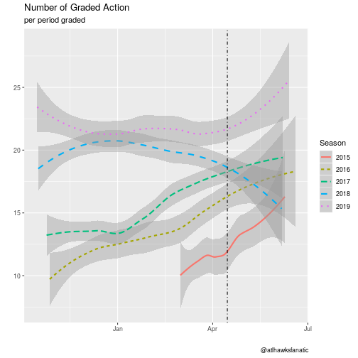
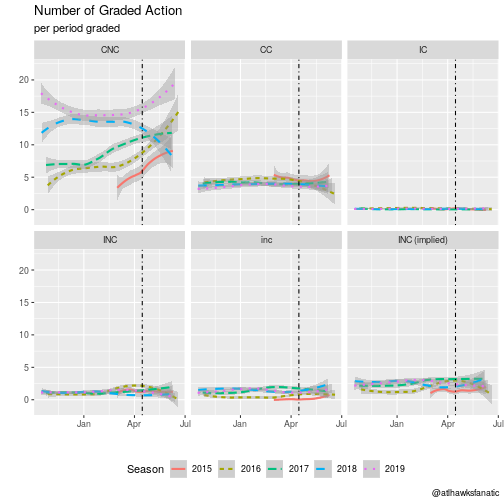

Since the NBA began their Last Two Minute Reports (L2M) on 2015-03-01, there have been 1,934 games which have received referee grades for at least their last two minutes of NBA action. While the general public may not understand the purpose of the L2Ms, the NBA provides a [FAQ](https://official.nba.com/nba-last-two-minute-reports-frequently-asked-questions/) for why L2Ms exist:

> **What is the purpose of issuing Last Two Minute Reports?**
> 
> L2Ms are part of the NBA's ongoing effort to build a greater awareness and understanding of the rules and processes that govern our game.  Additionally, it serves as a mechanism of accountability to our fans and the media who fairly seek clarifications after our games.
> 
> **Why did Last Two Minute Reports come about?**
> 
> There has always been a significant interest in our games, particularly close ones, and how they are officiated.  Before the L2M process, on occasion, the league acknowledged missed calls to the media via press release.  In order to give a more thorough picture of our officiating, and recognizing that NBA officials are correct roughly 90 percent of the time, we felt it important and fair to list all the correctly officiated plays as well.

While these justifications appear fairly straight-forward, the actual L2M process has not been fully transparent. In fact, when I first analyzed the L2Ms on [Peachtree Hoops in February of 2017](https://www.peachtreehoops.com/2017/2/17/14638288/nba-last-two-minute-reports-changing) it was apparent that there were changes in the criteria for grading plays. Aside from how particular plays were graded, the process of deciding whether or not a game would be publicly released as a L2M were altered with little notice.

The NBA changed the criteria at the start of the 2017-18 NBA Season to publicly release "any game in which one team's lead over the other is three points or fewer at any point during the last two minutes of the fourth quarter or overtime." Prior to 2017-18 NBA Season, the score difference at the two minute mark of the fourth quarter needed to be five points or fewer to be included -- although if a game subsequently went into overtime then a L2M would be publicly released. And there was once a time when the NBA would grade all five minutes of an overtime, although the last time this occurred was on 2016-05-09 and has yet to happen since. There has been no public statement from the NBA as to why the overtime periods only include the last two minutes of said period, it just happened and hardly anyone noticed.

I am here to update my previous analysis with the added data for the 2017-18 and 2018-19 NBA Seasons with a data friendly format (comma separated values). There is another publicly available version of the L2M data in an analyst friendly format from the folks at [The Pudding](https://pudding.cool/2017/02/two-minute-report/), however they stopped updating their data after the 2018 NBA Finals. At the bottom of this (and [here](https://atlhawksfanatic.github.io/L2M/1-tidy/L2M/L2M.csv)), you can find my version of the data through the most recent 2019 NBA Finals and code to reproduce it. Consider this some public service.

But let's dig in to see how the L2Ms have continued to change over time by first going through a refresher for how the games are graded.

<!-- ```{r time-remaining} -->
<!-- l2m %>%  -->
<!--   ggplot(aes(date, time2)) + -->
<!--   geom_point() + -->
<!--   theme_minimal() + -->
<!--   labs(title = "Graded Play by Time Remaining", -->
<!--        x = "Year", y = "time remaining", caption = "@atlhawksfanatic") -->

<!-- ``` -->

# L2M Grades

The L2M will provide grades for particular actions in the last two minutes of fourth quarter and overtimes in a game. The exact definition of an action is unclear and which actions get included from a play is also murky as our only guidance for each grade is they will be included "if it is a material play directly related to the outcome of the possession or there is confusion/misunderstanding about the application of the relevant rule among teams, media and/or fans."

That said, there are five categories for decisions on each graded action for a L2M, although practically there are only four:

1. Correct Call (CC) - a whistle was blown and the referees made the correct call.
2. Incorrect Call (IC) - a whistle was blown and the referees did not make the correct call.
3. Incorrect Non-Call (INC) - a whistle was not blown but an infraction occurred during action that should have resulted in a call.
4. Correct Non-Call (CNC) - a whistle was not blown during action but an infraction did not occur.
5. *blank* - a blank decision typically comes with a disclaimer in the comments that the play is either `[Detectable with stop watch]`, `[Incidental or immaterial]`, or `[Observable in enhanced video]`, but practically speaking these are incorrect non-calls as an infraction occurred and the referees did not blow whistle.

The CC and IC are straight-forward as a whistle was blown and the L2M will indicate if this was a correct call or not. When a whistle is blown the NBA would prefer that the referee is certain that an infraction has occurred -- I call this Correct Call Percentage which is simply \\( \frac{CC}{CC + IC} \\) and the NBA would want this to be as close to 100% as possible. Likewise, the INC (and *blank*) categories are fairly straight-forward since an infraction clearly occurred on the play that should have been called but was not. Presumably, the NBA would like the referees to pick up all infractions which occur on the court at a given time and avoid calling an infraction if it did not occur -- I call this Bad Calls Percentage which would be \\( \frac{IC + INC}{CC + IC + INC} \\) and the NBA would want this as close to 0% as possible. A summary for each NBA Season can be seen below in relation to these variables.

<table>
<caption>L2M Call Accuracy</caption>
 <thead>
  <tr>
   <th style="text-align:center;"> Season </th>
   <th style="text-align:center;"> Games </th>
   <th style="text-align:center;"> Calls per period </th>
   <th style="text-align:center;"> Incorrect Calls per period </th>
   <th style="text-align:center;"> Correct Call Percentage </th>
   <th style="text-align:center;"> Incorrect Non-Calls per period </th>
   <th style="text-align:center;"> Bad Calls Percentage </th>
  </tr>
 </thead>
<tbody>
  <tr>
   <td style="text-align:center;"> 2015 </td>
   <td style="text-align:center;"> 139 </td>
   <td style="text-align:center;"> 4.82 </td>
   <td style="text-align:center;"> 0.15 </td>
   <td style="text-align:center;"> 96.9% </td>
   <td style="text-align:center;"> 1.37 </td>
   <td style="text-align:center;"> 24.6% </td>
  </tr>
  <tr>
   <td style="text-align:center;"> 2016 </td>
   <td style="text-align:center;"> 439 </td>
   <td style="text-align:center;"> 4.77 </td>
   <td style="text-align:center;"> 0.21 </td>
   <td style="text-align:center;"> 95.6% </td>
   <td style="text-align:center;"> 1.66 </td>
   <td style="text-align:center;"> 29.1% </td>
  </tr>
  <tr>
   <td style="text-align:center;"> 2017 </td>
   <td style="text-align:center;"> 428 </td>
   <td style="text-align:center;"> 4.14 </td>
   <td style="text-align:center;"> 0.08 </td>
   <td style="text-align:center;"> 98.1% </td>
   <td style="text-align:center;"> 2.50 </td>
   <td style="text-align:center;"> 38.8% </td>
  </tr>
  <tr>
   <td style="text-align:center;"> 2018 </td>
   <td style="text-align:center;"> 475 </td>
   <td style="text-align:center;"> 4.14 </td>
   <td style="text-align:center;"> 0.12 </td>
   <td style="text-align:center;"> 97.1% </td>
   <td style="text-align:center;"> 2.46 </td>
   <td style="text-align:center;"> 39.1% </td>
  </tr>
  <tr>
   <td style="text-align:center;"> 2019 </td>
   <td style="text-align:center;"> 453 </td>
   <td style="text-align:center;"> 3.63 </td>
   <td style="text-align:center;"> 0.14 </td>
   <td style="text-align:center;"> 96.2% </td>
   <td style="text-align:center;"> 2.54 </td>
   <td style="text-align:center;"> 43.4% </td>
  </tr>
</tbody>
</table>

The good: the correct call percentage seems to be consistently above 96% which is close to 100% and there have been fewer incorrect calls per period since the first two seasons of L2Ms.

The neutral: calls per period appears to be going down and there has been roughly the same amount of games for each full season (keep in mind 2014-15 NBA Season only has games from March onward).

The bad: bad calls have been increasing every season and incorrect non-calls have been higher than the first two seasons of L2Ms.

It is unclear why the number of calls per period has been trending downward over time. Is this because of an NBA directive for referees to not call as many fouls? Are referees responding to being publicly evaluated and reticent to blow the whistle? Is this a response from players to play sounder defense and not foul? There are likely other possibilities as well, but the gist is that fewer calls necessarily increases the bad calls percentage.

When looking at three of the four categories of grades in the L2M it appears that there are fewer grades and one would think the length of L2Ms have decreased over time. This is nowhere near the case by looking at a loess plot[^loess] of number of graded plays over time as it is clear there was some structural change in January of 2017 to drastically increase the number of grades (the vertical dotted line indicates playoffs, which will have fewer observations and be more noisy):




[^loess]: Stands for [local regression](http://r-statistics.co/Loess-Regression-With-R.html) and is a smoothed conditional mean of the number of plays per period for an L2M report. A raw plotting of L2M plays per period is quite noisy and we only want to highlight trends.

## Correct Non-Calls

The CNC category is not straight-forward and has the possibility to influence metrics about how "correct" an official may be. Any serious data analysis of referee performance should ignore this category as it's not clear what the criteria is to be a CNC and if this criteria has varied over time.

For each action, there are a large number of CNC available. Just think for a moment, as long as none of the 10 players on the court are in the paint for more than 3 consecutive seconds there are 10 potential CNC actions on a play. For each legal dribble, there is an available CNC action that no palming, travel, or double dribble occurred. The infinite possibilities of CNC action aside, a CNC does not clearly denote that a referee observed this particular action and consciously decided it was a legal action because the very nature of a CNC is passive inaction. I am not saying that the NBA L2Ms are nefarious in their CNC grades (more on that later), but the very concept of a CNC is so loony that it should not be taken seriously.

That bit of a rant aside, we can look at the number of graded actions for L2Ms by decisions. In the following chart, I have coded the *blank* decisions as "inc" but also taken the liberty to be practical and combine the *blank* decisions with the INC for the "INC (implied)" category. As you can see, the overwhelming amount of action in the reports is CNC and this category has crept up each season:



The implications of an increased CNC count? Well that is clear, if one wanted to see how often a referee was "correct" then a naive metric would be to construct a version of correct plays divided by total plays -- \\( \frac{CC + CNC}{CC + CNC + IC + INC} \\) where one should include the *blank* calls into the INC but maybe they do not. Let's call this Naive Accuracy and if one does that, then clearly it looks like the NBA referees have been improving in accuracy over time:


| Season | Games | Grades per period | Naive Accuracy (without blanks) | Naive Accuracy (including blanks) |
|:------:|:-----:|:-----------------:|:-------------------------------:|:---------------------------------:|
|  2015  |  139  |       11.3        |              87.0%              |               86.5%               |
|  2016  |  439  |       12.9        |              88.5%              |               85.5%               |
|  2017  |  428  |       15.0        |              91.4%              |               82.8%               |
|  2018  |  475  |       19.7        |              93.8%              |               86.9%               |
|  2019  |  453  |       21.3        |              93.2%              |               87.4%               |

Eyeballing these estimates, the Naive Accuracy without *blanks* could be roughly thought of as around 90% with a very clear upward trend. There is less of a pronounced trend when including the *blank* category and it is consistently below 90%. The claim of 90% accuracy is important to note because in the NBA's FAQ for L2M it states "NBA officials are correct roughly 90 percent of the time" as you can see at the beginning of this article.

Why should 90% matter? I have no idea aside from that being thought of as the standard threshold for an "A" in academic work. But it is also possible [Campbell's Law](https://en.wikipedia.org/wiki/Campbell%27s_law) is at work and the NBA has already decided their level of success for referees should be 90% and they are striving to achieve it with their reports. Frankly, I do not know the reason nor do I think anyone should care because this is a poorly constructed measure for evaluating referees.

But to be clear, the large-scale increase in CNC certainly has an effect of improving the Naive Accuracy measures but that does not imply nefarious activity of CNC. If any cooking of the books existed, then we should see L2M reports with IC or INC calls in them to have more CNC calls as a way to target the 90% threshold. We can break apart the L2Ms by this criteria for each season to see if there are systematically more CNC with reports of a bad call than without, it turns out there is not much evidence this occurs:

<table>
<caption>CNC Count Conditional on IC in Report</caption>
 <thead>
  <tr>
   <th style="text-align:center;"> Season </th>
   <th style="text-align:center;"> IC Occurred </th>
   <th style="text-align:center;"> No IC Occurred </th>
   <th style="text-align:center;"> Share of Games With IC </th>
  </tr>
 </thead>
<tbody>
  <tr>
   <td style="text-align:center;"> 2015 </td>
   <td style="text-align:center;"> 3.61 </td>
   <td style="text-align:center;"> 5.46 </td>
   <td style="text-align:center;"> 18.0% </td>
  </tr>
  <tr>
   <td style="text-align:center;"> 2016 </td>
   <td style="text-align:center;"> 6.43 </td>
   <td style="text-align:center;"> 6.45 </td>
   <td style="text-align:center;"> 22.3% </td>
  </tr>
  <tr>
   <td style="text-align:center;"> 2017 </td>
   <td style="text-align:center;"> 8.36 </td>
   <td style="text-align:center;"> 8.36 </td>
   <td style="text-align:center;"> 8.18% </td>
  </tr>
  <tr>
   <td style="text-align:center;"> 2018 </td>
   <td style="text-align:center;"> 12.61 </td>
   <td style="text-align:center;"> 13.14 </td>
   <td style="text-align:center;"> 12.6% </td>
  </tr>
  <tr>
   <td style="text-align:center;"> 2019 </td>
   <td style="text-align:center;"> 14.99 </td>
   <td style="text-align:center;"> 15.15 </td>
   <td style="text-align:center;"> 14.3% </td>
  </tr>
</tbody>
</table>


<table>
<caption>CNC Count Conditional on INC in Report</caption>
 <thead>
  <tr>
   <th style="text-align:center;"> Season </th>
   <th style="text-align:center;"> INC Occurred </th>
   <th style="text-align:center;"> No INC Occurred </th>
   <th style="text-align:center;"> Share of Games With INC </th>
  </tr>
 </thead>
<tbody>
  <tr>
   <td style="text-align:center;"> 2015 </td>
   <td style="text-align:center;"> 5.29 </td>
   <td style="text-align:center;"> 4.38 </td>
   <td style="text-align:center;"> 73.4% </td>
  </tr>
  <tr>
   <td style="text-align:center;"> 2016 </td>
   <td style="text-align:center;"> 6.69 </td>
   <td style="text-align:center;"> 5.45 </td>
   <td style="text-align:center;"> 77.0% </td>
  </tr>
  <tr>
   <td style="text-align:center;"> 2017 </td>
   <td style="text-align:center;"> 8.42 </td>
   <td style="text-align:center;"> 7.22 </td>
   <td style="text-align:center;"> 93.7% </td>
  </tr>
  <tr>
   <td style="text-align:center;"> 2018 </td>
   <td style="text-align:center;"> 12.99 </td>
   <td style="text-align:center;"> 14.11 </td>
   <td style="text-align:center;"> 92.0% </td>
  </tr>
  <tr>
   <td style="text-align:center;"> 2019 </td>
   <td style="text-align:center;"> 15.08 </td>
   <td style="text-align:center;"> 15.83 </td>
   <td style="text-align:center;"> 93.8% </td>
  </tr>
</tbody>
</table>

What is clear is that there are more CNC calls in each season, regardless of whether or not a bad call happened.

# Where does this leave us?

Back in February of 2017, I noticed a stark change in the number of CNC calls. Following up more than two years later, it is clear that January 2017 was when something happened in reporting for L2Ms. And after this change? Well, the L2Ms had a major change and then appear to slowly creep up in the number of CNC calls to create this artificial 90% value of correct calls.

But there's no actual evidence that referees are improving in accuracy. We actually see stagnating levels of whistles being correct while there are fewer whistles and more bad calls. This would suggest worse performance of referees in games which qualify for L2Ms.

Can we be sure referee performance has declined? No. We have a clearly biased sample of only close games and the confounding factor that referees know these reports are publicly released. We already know that MLB umpire performance was affected by [QuestTec](https://www.sporttechie.com/questec-legacy-20-years-strike-zone/) ballparks when the umpires knew they were being evaluated.

For us to actually have an idea of whether or not referee performance has changed, we at least need to see L2M reports for all games. Full game reports would obviously be better.

You can find the L2M data here: <https://atlhawksfanatic.github.io/L2M/1-tidy/L2M/L2M.csv>

And all of the code to reproduce it is available here: <https://atlhawksfanatic.github.io/L2M/>

This shouldn't have been something I needed to do, because transparency would imply an easily accessible format. Do better, NBA. Instead of claiming to be transparent you should actually be transparent.
